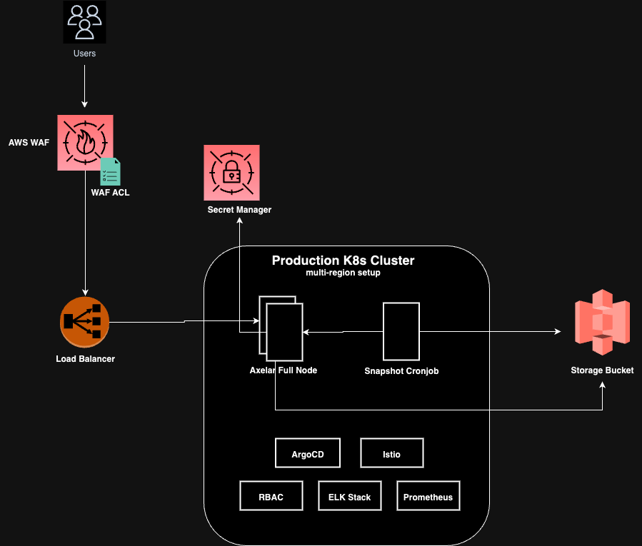

# Axelar Node Setup Helm Chart

## Introduction
This repository contains a architecture for setup of Axelar node using Kubernetes as the base

**High-level Components**:
1. **Axelar Node:** Fleet of Axelar blockchain nodes to serve RPC requests.
2. **Snapshot Cronjob:** K8s cronjob to take snapshot of existing nodes in certain period.
3. **Bucket:** used to store & retrive snapshot of node
4. **Secret Manager:** used to store sensitive information related to nodes like: Mnemonic, Private Key, etc

## Architecture

High Level Architecture Diagram

<p align="center"></p>

**NOTE**
- HPA is enabled on Nodes to handle incoming traffic
- A custom healthcheck setup is enabled on each node to ensure they are sync to a certain range from chain height 
 
## Setup & Testing

### Prerequisite
- Should have access to a working kubernetes cluster (minikube should also work)

### Update configurations
- Change values in `./chart/values.yaml` as per the requirement

### Install on Cluster
- Run this command:
```bash
$ helm upgrade --install axelar-testnet -f values.yaml ./ -n default
```

- Once the node is started, its logs should look like:
```bash
2023-11-13T17:24:19Z INF commit synced commit=436F6D6D697449447B5B3633203136352036322032333120313635203638203130362033302037352032302032342036382031302031303720313632203136362032353520323339203133342031313520313139203134362031393020313538203234362032353420313936203136203736203835203134362035325D3A4130443432317D
2023-11-13T17:24:19Z INF committed state app_hash=3FA53EE7A5446A1E4B1418440A6BA2A6FFEF86737792BE9EF6FEC4104C559234 height=10540065 module=state num_txs=0
2023-11-13T17:24:19Z INF indexed block exents height=10540065 module=txindex
2023-11-13T17:24:21Z INF received proposal module=consensus proposal={"Type":32,"block_id":{"hash":"999E9F152D8161621A5C2060B33457CC0344CCC084392F4EBE05605D50C000BB","parts":{"hash":"18F9CB2C28DDC42EE0DDC1A05FDBDAFD44ED70CCA3F8ED71BE095C0025C52551","total":1}},"height":10540066,"pol_round":-1,"round":0,"signature":"yXZIdh184eRK+7Z0zUowrAyXuRBEz3dugfYw9+ebIRX39+EI6qUxU5s1GMVrHqUQcmpUAiCQqbQR11NU7wVGAQ==","timestamp":"2023-11-13T17:24:21.718591747Z"}
2023-11-13T17:24:21Z INF received complete proposal block hash=999E9F152D8161621A5C2060B33457CC0344CCC084392F4EBE05605D50C000BB height=10540066 module=consensus
2023-11-13T17:24:22Z INF finalizing commit of block hash={} height=10540066 module=consensus num_txs=0 root=3FA53EE7A5446A1E4B1418440A6BA2A6FFEF86737792BE9EF6FEC4104C559234
```


## TODO / Future Improvements
- Support for secret manager
- Integrate WAF 
- Support for snapshot cronjob
